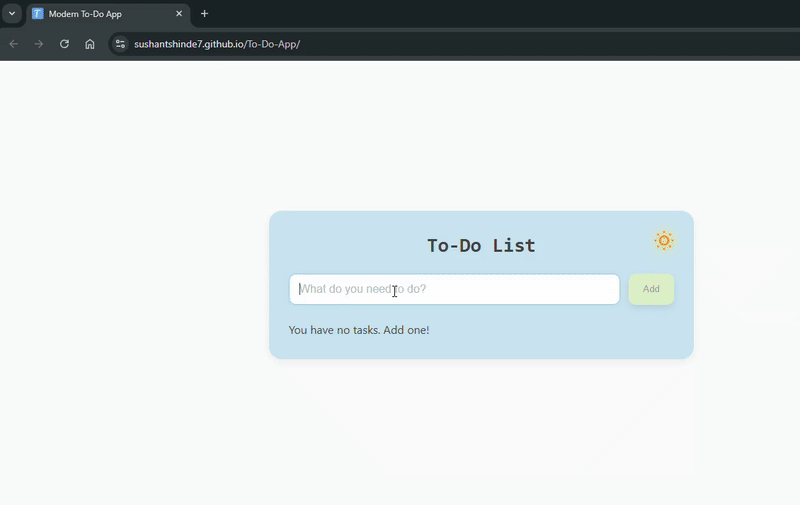

# 📝 Modular To-Do App 

> 🔗 Live Demo: [Modular Todo App Live](https://sushantshinde7.github.io/modular-todo-js/)

> 📦 Repository: [modular-todo-js](https://github.com/sushantshinde7/modular-todo-js)
 


> “Now a full PWA — fast, installable, offline-ready, and built with clean modular JavaScript.”

A sleek, responsive, and customizable To-Do application built using modular JavaScript (ES Modules), HTML, and CSS.


## 🎥 Preview 




## 📌 Features

### Core Features

| Feature | Description |
|--------|-------------|
| ✅ Add, edit, delete, pin | Full task control with smooth interactions |
| 📌 Smart Pin Sorting | Pinned tasks stay on top while preserving order |
| 🔍 Task Filters | View All, Pending, Completed, or Pinned tasks |
| 🔢 Auto Numbering | Tasks re-number automatically on pin/unpin |
| 📊 Live Task Counts | Real-time counts across all filters |
| ✏️ Inline Editing | Edit tasks in place with Enter or blur-to-save |
| ⌨️ Keyboard-First Input | Enter-to-add with auto-focus and keyboard flow |
| 💾 LocalStorage | Tasks and preferences persist locally |
| 📱 PWA Support | Installable app with offline mode and smart caching |
| ⚡ Offline Alert | Dismissible offline banner on network loss |
| 🔄 App Update Banner | Notifies users when a new version is available |


### UX, Interaction & Visual Feedback

| Feature | Description |
|--------|-------------|
| 🔄 Task Animations | Smooth add, edit, pin/unpin, and clear-all |
| 🧠 Smooth Reordering | FLIP-based animations for natural motion |
| ✨ Enhanced Micro-Animations | Polished transitions across CRUD actions |
| 🎯 Completion Feedback | Gradient strike-through on task completion |
| 🔔 Toast Notifications | Instant feedback on user actions |
| 🧼 Empty State | Illustrated view when no tasks exist |
| 🧭 Contextual Empty States | Filter-aware empty views |
| 🖼️ Improved Empty States | Light/Dark SVGs for no-task and no-pending |
| 🧠 Motivational Quotes | Rotates quotes when task count is low |
| 🎭 Quote Transitions | Smooth fade between quotes |
| 💬 Smart Input Hints | Dynamic placeholders guide user intent |


### Theming, Accessibility & Architecture

| Feature | Description |
|--------|-------------|
| 🌗 Theme Switcher | Light/Dark mode with saved preference |
| 🎨 Color Themes (FAB) | Accent color selection per theme |
| 🌈 Color Persistence | Remembers colors per theme |
| 💡 Dark Mode Colors | Contrast-optimized dark palette |
| ✨ FAB Highlight | Active color indicator with animation |
| 🎨 Dynamic Color Tooltip | Live accent preview |
| 🖱️ Themed Scrollbar | Scrollbar adapts to selected color |
| 📱 Responsive | Works seamlessly across devices |
| ♿ Accessibility | Keyboard navigation and ARIA labels |
| 🎨 Lucide Icons | Lightweight, consistent icon system |
| 🧩 Modular JS Logic | Clean, scalable architecture |
| 🧩 UI State Handling | Centralized logic for UI conditions |
| ♻️ Smart SW Update Flow | Detects service worker updates and prompts refresh |
| 🧱 Separated Concern Modules | Logic split into task, UI, config, and state layers |


🚀 Getting Started
- Clone the repository  
- git clone https://github.com/sushantshinde7/modular-todo-js.git


📂 Open in your browser
- Option 1: Just open index.html in your browser.  
- Option 2: Use the Live Server extension in VS Code for auto-refresh while editing. 

 
🗂️ Project Structure
```
modular-todo-js/
├── .github/
│   └── workflows/
│       └── deploy.yml
│
├── assets/
│   ├── icons/
│   │   ├── icon-192.png
│   │   ├── icon-512.png
│   │   └── maskable-icon-512.png
│   │
│   ├── no-completed-dark.svg
│   ├── no-completed-light.svg
│   ├── no-pending-dark.svg
│   ├── no-pending-light.svg
│   ├── no-pinned-dark.svg
│   ├── no-pinned-light.svg
│   ├── no-task-dark.svg
│   ├── no-task-light.svg
│   │
│   └── Todo-app-Demo.gif
│
├── src/
│   ├── main.js
│   │
│   ├── config/
│   │   └── constants.js
│   │
│   ├── tasks/
│   │   ├── taskStore.js
│   │   ├── taskManager.js
│   │   └── taskUI.js
│   │
│   └── ui/
│       ├── themeManager.js
│       ├── feedbackUI.js
│       └── bannerUI.js
│
├── styles/
│   └── styles.css
│
├── index.html
├── favicon.ico
├── manifest.json
├── service-worker.js
├── sw-register.js
└── README.md

```
> Project follows a separation-of-concerns architecture by isolating task logic, UI rendering, feedback systems, theme management, and configuration into dedicated ES module layers.


🛠 Tech Stack


> Developed using HTML5 for structure, CSS3 for styling and responsiveness, and modular JavaScript (ES6 Modules) for separated, maintainable application architecture. Tasks persist via LocalStorage, with a modern UI enhanced by Lucide Icons.

## 🆕 What's New
- Refactored monolithic logic into modular ES6 architecture  
- Full PWA support with installability, offline caching, and update banner  
- Brand-new task filtering (All / Pending / Completed / Pinned)  
- New empty-state illustrations for light & dark themes  
- Dynamic theme-color tooltip with live preview  
- Improved animations for CRUD actions and pin/unpin  
- Theme-adaptive scrollbar styling  

📐 UI & UX Highlights
- Smooth task animations for add, delete, edit, pin, and clear actions.
- Animated theme toggle with neon/pastel transitions.
- Empty-state illustration and motivational quote banners for better user engagement.
- Minimalist, accessible design with keyboard navigation and screen reader support.

## 👤 Author
**Sushant Shinde**  
[](https://github.com/sushantshinde7)
[](https://www.linkedin.com/in/sushantshinde7/)

## 📄 License
This project is licensed under the [MIT License](LICENSE).

📬 Have suggestions? Open an issue or share feedback!
---
⭐ If you like this project, consider giving it a star — it motivates me to keep improving!


